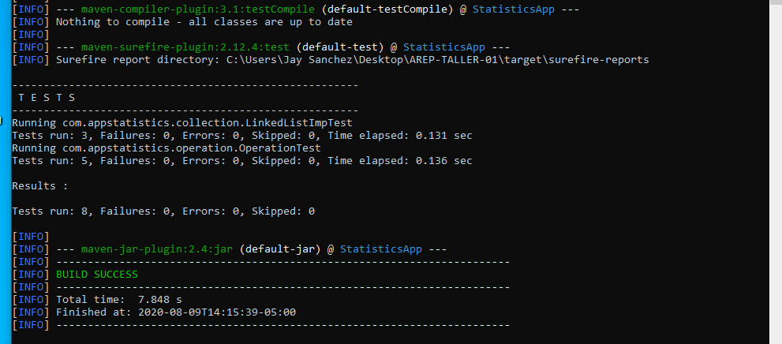
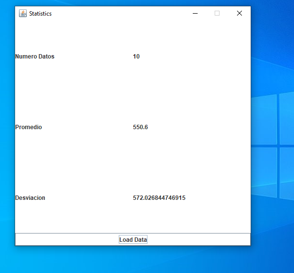

# AREP-TALLER-01

### Autor: Jeisson G. Sanchez R.

#### Descripcion General

La presente es una herramienta diseñada con el objetivo de poder calcular la media y el promedio de un conjunto de datos.

La aplicacion costa de:

- Una Lista enlazada.
- Una clase con métodos estáticos para operaciones.
- Pruebas de la lista y las operaciones estadisticas.
- Una interfaz grafica.

#### Pruebas aceptadas

~~~
    mvn test
~~~

Las pruebas con los nombres testCase01 y testCase02 corresponden a cargar los datos de la columna 1 y 2 respectivamente del ejemplo dado en el enunciado, y valida el resultado decimal, para la prueba como en el ejemplo se mostraban únicamente 2 decimales y nuestro resultado podría estar por debajo tomamos un delta de error de 0.005

#### La aplicacion 

~~~
  mvn exec:java -Dexec.mainClass="com.appstatistics.App"
~~~

La aplicación cuenta con un botón para cargar los datos de un archivo y los campos para mostrarnos el tamaño de la muestra, y las 2 medidas estadísticas solicitadas(media y desviación estándar)

### Licencia

[ver](LICENSE)

#### Escrito

[ver](AREP_T_01.pdf)

#### Javadoc

[codigo](javadoc/apidocs)

[pruebas](javadoc/testapidocs)

~~~
  mvn javadoc:javadoc
  mvn javadoc:test-javadoc
~~~

